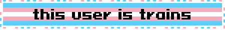

<h2 align="center">Hi 👋! 
My name is Valerie and I'm a self-taught developer & programmer from England, UK.</h2>

###

  
  
  

###

  
  

###

  
  
  
  
  
  
  
  
  
  
  
  
  
  
  
  
  
  
  
  
  
  
  
  
  
  
  
  
  
  
  

###

  
  
  
  

###

 

<picture>
  <source media="(prefers-color-scheme: dark)" srcset="https://raw.githubusercontent.com/Snoozeds/Snoozeds/output/pacman-contribution-graph-dark.svg">
  <source media="(prefers-color-scheme: light)" srcset="https://raw.githubusercontent.com/Snoozeds/Snoozeds/output/pacman-contribution-graph.svg">
  
</picture>

###

Profile views

###

###
